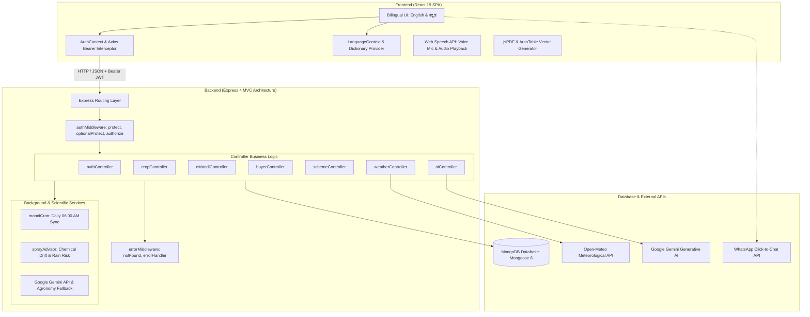

# farmX | KisanConnect (ಕಿಸಾನ್ ಕನೆಕ್ಟ್)
### Next-Generation MERN Agritech & Direct Farmer-to-Buyer Marketplace

[](https://mongodb.com)
[](https://react.dev)
[](https://nodejs.org)
[](https://expressjs.com)
[](https://mongoosejs.com)
[](LICENSE)

A full-stack agricultural decision support and digital trading ecosystem built with the **MERN Stack** (MongoDB, Express.js, React 19, Node.js). **farmX / KisanConnect** eliminates exploitative middlemen, equips farmers with AI-driven agronomic guidance and hyper-local spray advisories, and provides an end-to-end digital marketplace with direct buyer bidding, WhatsApp negotiation, and automated APMC gate pass dispatch slips.

---

## 📑 Table of Contents
1. [System Architecture](#-system-architecture)
2. [Technology Stack Matrix](#-technology-stack-matrix)
3. [Project Directory Tree](#-project-directory-tree)
4. [Core Features & Code Implementation Details](#-core-features--code-implementation-details)
   - [1. MVC Architecture & Route Protection](#1-mvc-architecture--route-protection)
   - [2. Live e-Mandi Marketplace & Bidding Engine](#2-live-e-mandi-marketplace--bidding-engine)
   - [3. Hyper-Local Weather & Smart Spray Advisory](#3-hyper-local-weather--smart-spray-advisory)
   - [4. Bilingual AI Crop Advisor & Offline Agronomy Engine](#4-bilingual-ai-crop-advisor--offline-agronomy-engine)
   - [5. Automated Mandi Rate Synchronization (Cron)](#5-automated-mandi-rate-synchronization-cron)
   - [6. Scientific Fertilizer Calculator & PDF Soil Health Card](#6-scientific-fertilizer-calculator--pdf-soil-health-card)
   - [7. Comprehensive User Authentication & Profile](#7-comprehensive-user-authentication--profile)
   - [8. English & Kannada Bilingual Engine](#8-english--kannada-bilingual-engine)
5. [Database Schemas & Data Models](#-database-schemas--data-models)
6. [API Endpoints Reference](#-api-endpoints-reference)
7. [Environment Variables](#-environment-variables)
8. [Installation & Setup Guide](#-installation--setup-guide)
9. [Troubleshooting & Windows Tips](#-troubleshooting--windows-tips)

---

## 🏗️ System Architecture



---

## 💻 Technology Stack Matrix

| Layer | Technology | Version | Purpose in Project |
| :--- | :--- | :--- | :--- |
| **Frontend UI** | **React.js** | `^19.2.5` | Modern Component-driven Single Page Application (SPA) |
| **Routing** | **React Router DOM** | `^7.14.2` | Declarative client-side routing and protected view transitions |
| **Styling** | **Vanilla CSS + Glassmorphism** | Custom | Responsive HSL color tokens, dark/light theme switching, 3D lift effects |
| **HTTP Client** | **Axios** | `^1.15.2` | REST API communication with global JWT header injection |
| **Icons** | **Lucide React** | `^1.11.0` | Accessible agricultural, UI, and navigation vector iconography |
| **Charts** | **Recharts** | `^3.8.1` | 14-day rolling Mandi price trend visualizer |
| **Voice / Speech** | **react-speech-recognition** | `^4.0.1` | Speech-to-Text input for voice queries in Kannada & English |
| **Speech Output** | **Web SpeechSynthesis API** | Native | Text-to-Speech audio readout of agricultural advice |
| **PDF Export** | **jsPDF + jspdf-autotable** | `^2.5.1` / `^3.8.2` | Client-side official PDF Farm Advisory & Soil Health Card generator |
| **Backend Runtime** | **Node.js** | `v18+` | High-performance asynchronous V8 JavaScript runtime |
| **Web Framework** | **Express.js** | `^4.21.2` | RESTful API server with modular MVC architecture |
| **Database** | **MongoDB** | `8.9.5` | Document database for users, listings, crops, schemes, and buyers |
| **ODM** | **Mongoose** | `^8.9.5` | Strict schema validation, hooks, and virtual transforms |
| **Security / Auth** | **jsonwebtoken (JWT)** | `^9.0.2` | Stateless cryptographic bearer token authentication |
| **Password Hashing**| **bcryptjs** | `^2.4.3` | One-way salted cryptographic password hashing |
| **Scheduler** | **node-cron** | `^3.0.3` | Scheduled background task synchronizing daily Mandi rates at 06:00 AM |
| **Weather API** | **Open-Meteo REST API** | Free Tier | Real-time weather, precipitation probability, and wind velocity |
| **AI LLM** | **Google Gemini API** | `v1beta` | Multilingual generative agricultural science advisory |

---

## 📂 Project Directory Tree

```text
farmx_mern/
├── .gitignore                         # Protects node_modules, build outputs, and .env secrets
├── README.md                          # Comprehensive technical project documentation
│
├── backend/                           # Express.js REST API Server
│   ├── .env                           # Local environment configuration (PORT, MONGO_URI, JWT_SECRET, GOOGLE_API_KEY)
│   ├── .env.example                   # Template environment variables for setup
│   ├── package.json                   # Backend dependencies and execution scripts
│   ├── server.js                      # Application entry point, CORS, and middleware registration
│   │
│   ├── config/
│   │   └── db.js                      # MongoDB connection handler with Mongoose
│   │
│   ├── controllers/                   # [MVC Layer] Business logic & DB transactions
│   │   ├── aiController.js            # Gemini API integration & domain-specific offline agronomy engine
│   │   ├── authController.js          # User registration, login, JWT issuance, profile retrieval & updates
│   │   ├── buyerController.js         # Verified buyer directory listing and creation
│   │   ├── cropController.js          # APMC crop discovery, details, and price synchronization
│   │   ├── eMandiController.js        # Harvest listings, buyer bidding, seller offer approval & gate pass
│   │   ├── schemeController.js        # Government agricultural subsidy & welfare schemes
│   │   └── weatherController.js       # Open-Meteo coordinate mapping & spray safety calculation
│   │
│   ├── middleware/                    # [MVC Layer] Reusable Express middlewares
│   │   ├── authMiddleware.js          # protect (JWT verification), optionalProtect, authorize(roles)
│   │   └── errorMiddleware.js         # notFound (404 catch-all) & errorHandler (structured 500 responses)
│   │
│   ├── models/                        # [MVC Layer] Mongoose Schemas & Data Constraints
│   │   ├── Buyer.js                   # Institutional & wholesale agro-buyer schema
│   │   ├── Crop.js                    # APMC crops with 14-day rolling price history
│   │   ├── HarvestListing.js          # Farmer harvest posts with embedded offer/bid subdocuments
│   │   ├── Scheme.js                  # Central & State (Karnataka) agricultural schemes
│   │   └── User.js                    # User account schema with bcrypt pre-save password hash
│   │
│   ├── routes/                        # [MVC Layer] Thin routing declarations with middleware guards
│   │   ├── aiRoutes.js                # POST /api/ai/text
│   │   ├── authRoutes.js              # /register, /login, /me, /profile, /logout
│   │   ├── buyerRoutes.js             # GET /api/buyers, POST /api/buyers
│   │   ├── cropRoutes.js              # GET /api/crops, POST /api/crops/sync
│   │   ├── eMandiRoutes.js            # /listings, /seller/:phone, /offers, /status
│   │   ├── schemeRoutes.js            # GET /api/schemes, POST /api/schemes
│   │   └── weatherRoutes.js           # GET /api/weather
│   │
│   ├── seeds/
│   │   └── seedData.js                # Seeds 23 Karnataka APMC crops, schemes, buyers, and demo listings
│   │
│   └── services/                      # Scientific and scheduled background services
│       ├── mandiCron.js               # node-cron scheduler (0 6 * * *) and random-walk price simulator
│       └── sprayAdvisor.js            # Agronomic spray suitability risk assessment algorithm
│
└── frontend/                          # React 19 Client Application
    ├── package.json                   # Frontend dependencies, scripts, and ESLint config
    ├── public/
    │   ├── index.html                 # HTML root with Google Fonts & responsive viewport
    │   ├── manifest.json              # Web app manifest
    │   └── favicon.ico
    │
    └── src/
        ├── App.js                     # Root layout, dynamic sidebar navigation, theme provider
        ├── App.css                    # Application layout and mobile drawer transitions
        ├── index.js                   # React DOM render entry point
        ├── index.css                  # Global CSS variables, themes (light/dark), and glassmorphic panels
        ├── AuthContext.js             # React Context for authentication & Axios global token interceptor
        ├── LanguageContext.js         # React Context for English / Kannada (ಕನ್ನಡ) UI dictionary
        │
        ├── pages/                     # Interactive Application Screens
        │   ├── CropPrices.js          # Live APMC Mandi price discovery & Recharts 14-day trend graphs
        │   ├── Dashboard.js           # Farmer command center (live metrics, weather summary, quick actions)
        │   ├── EMandi.js              # Full digital marketplace (listings, bidding modal, gate pass generator)
        │   ├── Fertilizer.js          # Scientific N-P-K fertilizer calculator & supplier finder
        │   ├── Login.js               # Secure user login screen
        │   ├── Profile.js             # Farmer/Buyer profile displaying real agronomic parameters
        │   ├── Recommend.js           # Bilingual AI Crop Guide (speech input, audio playback, PDF download)
        │   ├── Register.js            # Enhanced registration with role toggle, Karnataka districts & crops
        │   ├── Schemes.js             # Filterable Karnataka & Central agricultural welfare schemes
        │   ├── WeatherAdvisory.js     # 7-day weather forecast, spray safety banner, 12h timeline
        │   └── Buyers.js              # Verified agro-buyers directory with 1-click WhatsApp messaging
        │
        └── utils/
            └── generatePdf.js         # Official vector PDF generator for Soil Health Card & Advisory
```

---

## ⚙️ Core Features & Code Implementation Details

### 1. MVC Architecture & Route Protection
The backend follows strict **Model-View-Controller (MVC)** separation of concerns:
- **Routes (`backend/routes/`)**: Pure routing definitions that declare HTTP methods, paths, and middleware chains.
- **Controllers (`backend/controllers/`)**: Encapsulate all async business logic, request validation, database operations, and response formatting.
- **Middleware (`backend/middleware/authMiddleware.js`)**:
  - `protect`: Extracts `Bearer <token>` from the HTTP `Authorization` header, verifies the signature using `process.env.JWT_SECRET`, retrieves the user document omitting `password`, and attaches it to `req.user`. Returns `401 Unauthorized` if invalid or absent.
  - `optionalProtect`: Attaches `req.user` if a valid token is present, but allows guest access if absent.
  - `authorize(...roles)`: Verifies if `req.user.role` matches allowed roles (e.g. `'farmer'`, `'buyer'`, `'admin'`), returning `403 Forbidden` if unauthorized.
- **Frontend Interceptor (`frontend/src/AuthContext.js`)**:
  - Automatically sets `axios.defaults.headers.common['Authorization'] = 'Bearer ' + token` when a user signs in, ensuring all subsequent API calls throughout the app carry authenticated credentials seamlessly.

---

### 2. Live e-Mandi Marketplace & Bidding Engine
Eliminates agricultural intermediaries by connecting smallholders directly with verified bulk buyers:
- **Harvest Listing Creation (`POST /api/emandi/listings`)**:
  Farmers post crops specifying crop name, variety, expected harvest date, quantity (in quintals), and base reserve price (₹/Quintal). The controller automatically associates `sellerId: req.user._id` when authenticated.
- **Bidding Lifecycle (`POST /api/emandi/listings/:id/offers`)**:
  Buyers submit custom proposals with offered price, desired quantity, and procurement notes. Offers are pushed to the listing's embedded `offers` array, shifting status from `available` to `under_negotiation`.
- **Offer Acceptance / Rejection (`PATCH /api/emandi/listings/:id/offers/:offerId`)**:
  The listing seller can accept or reject individual offers. Accepting an offer marks the listing as `sold` and confirms transaction parameters.
- **APMC Gate Pass Generation (`FX-PASS-XXXXXX`)**:
  An automatic alphanumeric clearance slip is created for accepted shipments, suitable for APMC checkpoint clearance.
- **1-Click WhatsApp Direct Connect**:
  Formats procurement details into an encoded WhatsApp URI (`https://wa.me/91XXXXXXXXXX?text=...`) allowing buyers and sellers to negotiate without third-party commissions.

---

### 3. Hyper-Local Weather & Smart Spray Advisory
Chemical foliar sprays (insecticides, fungicides) applied before rain lead to complete chemical runoff, groundwater contamination, and wasted expenditure. High winds cause droplet drift and crop damage.
- **Meteorological Data Retrieval (`backend/controllers/weatherController.js`)**:
  Maps all 31 Karnataka agricultural districts (Bagalkot to Yadgir) to precise latitude/longitude coordinates and fetches real-time data from the **Open-Meteo Meteorological API**.
- **Agronomic Risk Algorithm (`backend/services/sprayAdvisor.js`)**:
  ```javascript
  // Dynamic spray safety calculation
  if (rainProbability > 45) {
    status = 'danger'; // Rain washes away chemicals within 2-4 hours
  } else if (currentWindSpeed > 15) {
    status = 'danger'; // Chemical drift hazard to neighboring crops
  } else if (currentHumidity > 78) {
    status = 'caution'; // High fungal risk (Early/Late Blight in Solanaceous crops)
  } else if (currentWindSpeed < 12 && rainProbability < 20) {
    status = 'safe'; // Optimal conditions for foliar uptake
  }
  ```
- **12-Hour Hourly Suitability Timeline**:
  Visual breakdown with color-coded safety indicators (🟢 Safe, 🟡 Caution, 🔴 Danger) so farmers know the exact morning or evening hour to commence spraying.

---

### 4. Bilingual AI Crop Advisor & Offline Agronomy Engine
Provides multilingual agricultural scientist intelligence accessible to non-English literate farmers:
- **Google Gemini API Multi-Model Cascade (`backend/controllers/aiController.js`)**:
  Calls Google Gemini's REST API (`v1beta`) with a sequential model fallback: `gemini-1.5-flash` &rarr; `gemini-2.0-flash` &rarr; `gemini-1.5-pro`.
- **Intelligent Offline Agronomy Engine**:
  If no API key is present or network fails, a comprehensive expert system answers specific queries for:
  - **Paddy / Rice**: Khaira disease, zinc deficiency, blast disease, stem borer control.
  - **Tomato / Solanaceae**: Early and late blight, Trichoderma viride, Mancozeb schedule.
  - **Cotton**: Black soil management, pink bollworm pheromone traps, magnesium deficiency.
  - **Sugarcane**: Trench planting, trash mulching for moisture preservation, early shoot borer.
  - **Ragi (Finger Millet)**: Red soil management, drought resistance, biofertilizers.
  - **Pests & Insects**: Integrated Pest Management (IPM), yellow sticky traps, 10,000 PPM neem oil.
  - **Fertilizers**: Basal, 30-day top dressing, and flowering split application ratios.
- **Voice Recognition (Speech-to-Text)**:
  Uses `react-speech-recognition` for speech input in Kannada (`kn-IN`) and English (`en-IN`).
- **Audio Playback (Text-to-Speech)**:
  Uses the browser's native `window.speechSynthesis` with dedicated play and stop controls, reading out advice clearly in the user's selected language.

---

### 5. Automated Mandi Rate Synchronization (Cron)
- **Background Cron Daemon (`backend/services/mandiCron.js`)**:
  Configured with `node-cron` to execute daily at **06:00 AM IST** (`0 6 * * *`).
- **Rolling 14-Day Price History**:
  Maintains an array of historical date/price tuples for all 23 Karnataka APMC crops. Each sync slides the window by one day, computing price variance percentages and visual market trends for the Recharts graph.
- **On-Demand Synchronization (`POST /api/crops/sync`)**:
  Protected endpoint allowing admins or farmers to force an immediate market synchronization.

---

### 6. Scientific Fertilizer Calculator & PDF Soil Health Card
- **NPK Nutrient Formulation (`frontend/src/pages/Fertilizer.js`)**:
  Calculates required bags of **Urea (Nitrogen 46%)**, **DAP (Phosphorus 46% + Nitrogen 18%)**, and **MOP (Potassium 60%)** based on crop type, acreage, and growing season.
- **Vector PDF Generator (`frontend/src/utils/generatePdf.js`)**:
  Uses `jspdf` and `jspdf-autotable` to generate official branded **"Farm Advisory & Soil Health Cards"** containing:
  - Farmer Name, Village, District, Acreage, and Primary Crop.
  - Split N-P-K Application Timetable (Basal, 30 Days, 60 Days).
  - Custom AI Diagnostic Advice and weather precautions.
  - Emergency Krishi Vigyan Kendra (KVK) helpline contacts (`1800-180-1551`).

---

### 7. Comprehensive User Authentication & Profile
- **Role-Based Architecture**:
  - 🌾 **Farmer / Producer**: Lists crops, reviews buyer offers, manages farm profile.
  - 🏢 **Buyer / Trader**: Places bids, tracks procurement interests, connects via WhatsApp.
- **Karnataka Geographical Profiling**:
  Registers farmer village, taluk, and district from all 31 Karnataka administrative districts.
- **Dynamic Profile Screen (`frontend/src/pages/Profile.js`)**:
  Displays real registered parameters (land acreage, primary crop, phone, location) with instant links to marketplace actions.

---

### 8. English & Kannada Bilingual Engine
- **Context Dictionary Provider (`frontend/src/LanguageContext.js`)**:
  Maintains a translation dictionary for all agricultural terms, navigation items, buttons, and alerts.
- **Instant Language Toggle**:
  Farmers can toggle between **English** and **ಕನ್ನಡ (Kannada)** instantaneously across any page without page reloading.

---

## 🗄️ Database Schemas & Data Models

### User Model (`backend/models/User.js`)
```javascript
{
  username: { type: String, required: true, unique: true, trim: true },
  email: { type: String, trim: true, lowercase: true, default: '' },
  password: { type: String, required: true }, // Salted bcrypt hash
  first_name: { type: String, default: '' },
  last_name: { type: String, default: '' },
  phone: { type: String, default: '' },
  village: { type: String, default: '' },
  district: { type: String, default: 'Mandya' },
  landSizeAcres: { type: Number, default: 2 },
  primaryCrop: { type: String, default: 'Sugarcane' },
  role: { type: String, enum: ['farmer', 'seller', 'buyer', 'admin'], default: 'farmer' }
}
```

### Harvest Listing Model (`backend/models/HarvestListing.js`)
```javascript
{
  sellerId: { type: mongoose.Schema.Types.ObjectId, ref: 'User', default: null },
  sellerName: { type: String, required: true, trim: true },
  sellerPhone: { type: String, required: true, trim: true },
  village: { type: String, required: true },
  district: { type: String, required: true },
  cropName: { type: String, required: true },
  variety: { type: String, default: 'Grade A Quality' },
  quantityQuintals: { type: Number, required: true, min: 1 },
  basePricePerQuintal: { type: Number, required: true, min: 1 },
  expectedHarvestDate: { type: String, required: true },
  description: { type: String },
  status: { type: String, enum: ['available', 'under_negotiation', 'sold'], default: 'available' },
  dispatchSlipNo: { type: String, default: () => 'FX-PASS-' + Math.floor(100000 + Math.random() * 900000) },
  offers: [
    {
      buyerName: { type: String, required: true },
      buyerPhone: { type: String, required: true },
      offeredPrice: { type: Number, required: true },
      quantityQuintals: { type: Number, required: true },
      message: { type: String },
      status: { type: String, enum: ['pending', 'accepted', 'rejected'], default: 'pending' },
      createdAt: { type: Date, default: Date.now }
    }
  ]
}
```

### Crop Model (`backend/models/Crop.js`)
```javascript
{
  name: { type: String, required: true },
  current_price: { type: Number, required: true },
  change: { type: Number, default: 0 },
  high_24h: { type: Number },
  low_24h: { type: Number },
  location: { type: String, default: 'Karnataka APMC' },
  category: { type: String, enum: ['Cereals', 'Pulses', 'Cash Crops', 'Vegetables', 'Fruits', 'Spices'] },
  history: [
    {
      date: { type: String },
      price: { type: Number }
    }
  ]
}
```

---

## 📡 API Endpoints Reference

| Method | Route | Access | Controller Handler | Purpose |
| :--- | :--- | :---: | :--- | :--- |
| `POST` | `/api/auth/register` | Public | `authController.registerUser` | Register farmer/buyer with full profile |
| `POST` | `/api/auth/login` | Public | `authController.loginUser` | Authenticate credentials & return JWT |
| `GET` | `/api/auth/me` | **Protected** | `authController.getMe` | Retrieve authenticated user profile |
| `PUT` | `/api/auth/profile` | **Protected** | `authController.updateProfile` | Update contact, land size, crop parameters |
| `POST` | `/api/auth/logout` | Public | `authController.logoutUser` | Clear session confirmation |
| `GET` | `/api/crops` | Public | `cropController.getCrops` | Filter crops by name or APMC location |
| `GET` | `/api/crops/:id` | Public | `cropController.getCropById` | Single crop price detail & 14-day history |
| `POST` | `/api/crops/sync` | **Protected** | `cropController.syncCrops` | Force manual Mandi price synchronization |
| `POST` | `/api/crops` | **Protected** | `cropController.createCrop` | Add new APMC crop to tracking list |
| `GET` | `/api/emandi/listings` | Public | `eMandiController.getListings` | Browse active harvest marketplace listings |
| `GET` | `/api/emandi/listings/:id`| Public | `eMandiController.getListingById` | Single listing details with offers |
| `GET` | `/api/emandi/seller/:phone`| Public/Auth | `eMandiController.getSellerListings` | Get my harvest listings & incoming offers |
| `POST` | `/api/emandi/listings` | Public/Auth | `eMandiController.createListing` | Post new harvest to marketplace |
| `POST` | `/api/emandi/listings/:id/offers` | Public/Auth | `eMandiController.placeBid` | Submit custom price offer / bid |
| `PATCH`| `/api/emandi/listings/:id/offers/:offerId` | **Protected** | `eMandiController.updateOfferStatus` | Accept or reject buyer's bid |
| `PATCH`| `/api/emandi/listings/:id/status` | **Protected** | `eMandiController.updateListingStatus` | Change status (`available`/`sold`) |
| `GET` | `/api/weather?district=Mandya` | Public | `weatherController.getWeatherData` | 7-day forecast & smart spray advisory |
| `POST` | `/api/ai/text` | Public/Auth | `aiController.getAiAdvice` | Bilingual Gemini AI crop consultation |
| `GET` | `/api/schemes` | Public | `schemeController.getSchemes` | Browse Karnataka & Central agro schemes |
| `GET` | `/api/buyers` | Public | `buyerController.getBuyers` | Directory of verified wholesale agro buyers |

---

## 🔐 Environment Variables

### Backend Configuration (`backend/.env`)
Create a `.env` file in the `backend/` directory based on `.env.example`:

```env
# Port on which Express server listens
PORT=5000

# MongoDB local or Atlas connection string
MONGO_URI=mongodb://127.0.0.1:27017/farmx

# Cryptographic secret key for signing JWT tokens
JWT_SECRET=farmx_super_secret_jwt_key_2026

# Optional: Google Gemini API Key (leaves blank to use expert offline agronomy engine)
GOOGLE_API_KEY=

# Default Gemini model name
GOOGLE_MODEL=gemini-1.5-flash
```

---

## 🚀 Installation & Setup Guide

### Prerequisites
- **Node.js**: `v18.0.0` or higher installed ([Download Node.js](https://nodejs.org))
- **MongoDB**: Community Server running locally on `mongodb://127.0.0.1:27017` or a MongoDB Atlas URI ([Download MongoDB](https://www.mongodb.com/try/download/community))
- **Git**: Installed and configured

---

### Step 1: Clone Repository
```powershell
git clone https://github.com/Mahendracb/KisanConnect.git
cd KisanConnect
```

---

### Step 2: Configure & Start Backend
Open a terminal in the `backend` directory:
```powershell
cd backend

# 1. Install dependencies
npm install

# 2. Seed database with 23+ APMC crops, schemes, buyers, and demo listings
npm run seed

# 3. Start the Express backend server
npm start
```
*The backend server will start on **`http://localhost:5000`** and output `[MongoDB Connected]: 127.0.0.1/farmx`.*

---

### Step 3: Start React Frontend
Open a second terminal in the `frontend` directory:
```powershell
cd frontend

# 1. Install dependencies
npm install --legacy-peer-deps

# 2. Launch development server
npm start
```
*The React application will compile and open in your default browser at **`http://localhost:3000`**.*

---

## 💡 Troubleshooting & Windows Tips

### 1. PowerShell Script Execution Policy
If Windows PowerShell blocks `npm` scripts with `UnauthorizedAccess` / `PSSecurityException`:
```powershell
Set-ExecutionPolicy -Scope Process -ExecutionPolicy Bypass
```
or invoke commands using the Windows command shim directly:
```powershell
npm.cmd start
```

### 2. Freeing Occupied Ports (5000 or 3000)
If port 5000 is already in use by another service:
```powershell
Get-Process -Id (Get-NetTCPConnection -LocalPort 5000 -State Listen).OwningProcess | Stop-Process -Force
```

### 3. Running Production Build
To validate or deploy the optimized production bundle:
```powershell
cd frontend
npm.cmd run build
```

---

## 👥 Contributors & Acknowledgements
- **Author**: Mahendra C B ([@Mahendracb](https://github.com/Mahendracb))
- **Repository**: [https://github.com/Mahendracb/KisanConnect](https://github.com/Mahendracb/KisanConnect)
- **Meteorological Data Provider**: Open-Meteo API
- **AI Intelligence**: Google DeepMind / Google Gemini API

---

### 📄 License
This project is open-source and distributed under the **MIT License**.
